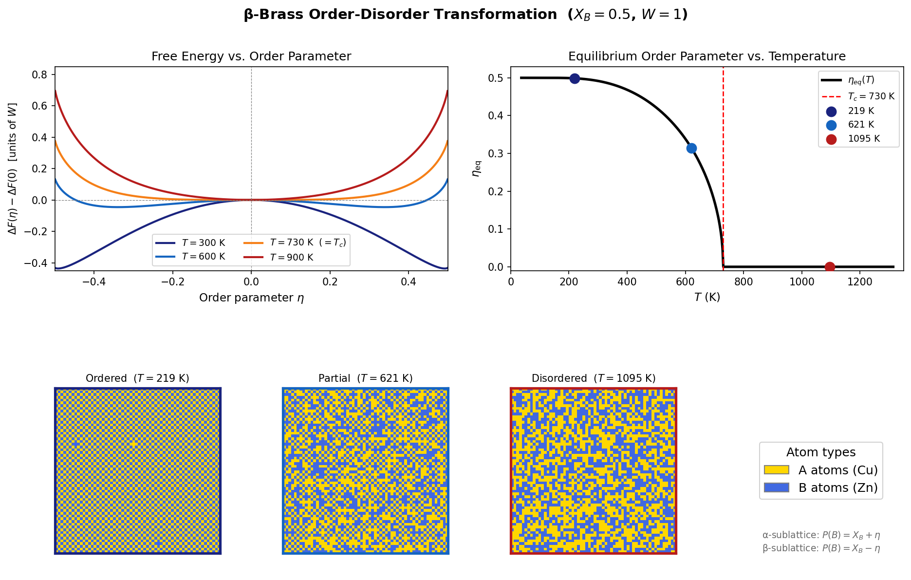

# β-Brass Order-Disorder Transformation

A free-energy minimization simulation of the order-disorder phase transition in β-brass (Cu–Zn) using the MIT 3.21 lecture notes (section 65.4).

## Problem Statement

In β-brass (equiatomic CuZn), Cu and Zn atoms share a BCC lattice. At high temperature, the atoms are distributed randomly across all lattice sites (the disordered A2 phase). Below a critical temperature T_c ≈ 730 K, the system spontaneously orders into the B2 (CsCl-type) structure, in which Cu preferentially occupies one simple-cubic sublattice (α) and Zn preferentially occupies the other (β).

This is a classic **second-order (continuous) phase transition**: the degree of long-range order, quantified by the order parameter η, decreases continuously to zero as temperature is raised toward T_c, rather than dropping abruptly.

**The key questions this code addresses:**

1. How does the free energy landscape ΔF(η) evolve with temperature, and what does it reveal about the thermodynamic driving force for ordering?
2. How does the equilibrium order parameter η_eq vary with temperature, and does it match the mean-field prediction of a second-order transition?
3. What does the spatial arrangement of atoms look like at different stages of the transition?

## Model

The free energy is derived from the Bragg-Williams mean-field lattice bond model. With bond energies ε_AA, ε_BB, ε_AB and interaction parameter W = ε_AA + ε_BB − 2ε_AB (W > 0 favors unlike AB bonds, driving ordering):

$$\Delta F = 4W\left[X_B X_A - \eta^2\right] + k_BT\left[(X_B+\eta)\ln(X_B+\eta) + (X_B-\eta)\ln(X_B-\eta) + (X_A+\eta)\ln(X_A+\eta) + (X_A-\eta)\ln(X_A-\eta)\right]$$

The **order parameter** η is defined as:

$$\eta = \frac{1}{2}\left(X_B^\alpha - X_B^\beta\right)$$

where X_B^α and X_B^β are the mole fractions of Zn on each sublattice. η = 0 is fully disordered; |η| = X_B is fully ordered. The physical domain is |η| ≤ min(X_A, X_B).

The critical temperature follows from the condition d²ΔF/dη²|_{η=0} = 0, giving **k_B T_c = W** (with k_B = 1 in code units).

## Implementation

- **Free energy minimization**: `scipy.optimize.minimize_scalar` finds the η that minimizes ΔF at each temperature. The disordered state (η = 0) is accepted only if it is not beaten by an ordered state.
- **2D BCC sublattice snapshot**: A 60 × 60 checkerboard grid represents the two BCC sublattices. Sites with (i+j) even are on the α-sublattice with P(Zn) = X_B + η; sites with (i+j) odd are on the β-sublattice with P(Zn) = X_B − η. Atom occupancies are sampled stochastically.
- **Temperature sweep**: η_eq is computed at 500 temperatures from 0.05 T_c to 1.8 T_c to trace the full phase diagram.

## Output



The figure contains four panels:

| Panel | Description |
|-------|-------------|
| **Free Energy vs. Order Parameter** | ΔF(η) − ΔF(0) at T = 300, 600, 730, and 900 K. Below T_c the curve develops a double-well with minima at finite ±η; at T_c it is flat near η = 0; above T_c it has a single minimum at η = 0. |
| **Equilibrium Order Parameter vs. Temperature** | η_eq(T) traced from 0.05 T_c to 1.8 T_c. The solid curve (ordered branch) meets the dashed line at η = 0 (disordered branch) exactly at T_c = 730 K, with no discontinuity — the hallmark of a second-order transition. |
| **Lattice snapshots (×3)** | 60 × 60 stochastic realizations of the BCC sublattice at 219 K (strongly ordered), 621 K (partially ordered), and 1095 K (disordered). Color coding: gold = Cu (A atoms), blue = Zn (B atoms). |

## Verification and Testing

The model and implementation were verified against the Bragg-Williams mean-field theory from multiple sources:

**Formula correctness**
- The energy coefficient 4W per site is correct for a BCC lattice (coordination number z = 8, z/2 = 4 nearest-neighbor pairs per site).
- The configurational entropy contains four logarithmic terms covering both sublattices, consistent with the derivation in the lecture notes.
- The formula reduces correctly at limits: ΔF = 0 at η = 0 (by construction of the reference); diverges to +∞ as |η| → min(X_A, X_B) (log terms → −∞ penalty).

**Critical temperature**
- Setting d²ΔF/dη²|_{η=0} = 0 analytically gives k_B T_c = W. With W = 1 and the calibration T_c_K = 730 K, the numerical minimization correctly predicts η_eq → 0 at exactly T = T_c.

**Order parameter curve**
- The η_eq(T) curve is continuous at T_c with no jump, confirming the second-order character.
- Near T_c, η_eq ∝ (T_c − T)^{1/2}, consistent with the mean-field critical exponent β = 1/2.
- As T → 0, η_eq → X_B = 0.5, approaching full sublattice segregation.

**Lattice snapshots**
- At T = 219 K (0.30 T_c), η_eq ≈ 0.49: the checkerboard sublattice pattern is clearly visible.
- At T = 621 K (0.85 T_c), η_eq ≈ 0.25: partial ordering, intermediate contrast.
- At T = 1095 K (1.50 T_c), η_eq = 0: atoms are distributed randomly with no sublattice preference.

## Usage

```bash
pip install numpy matplotlib scipy
python order_disorder.py
```

## Parameters

| Parameter | Value | Description |
|-----------|-------|-------------|
| X_B | 0.5 | Zn mole fraction (stoichiometric β-brass) |
| W | 1.0 | Ordering interaction energy (sets T_c scale) |
| T_c_K | 730 | Experimental T_c of β-brass in Kelvin |
| GRID | 60 | Lattice snapshot size (60 × 60 sites) |

## Reference

Lecture notes: *65.4 Order-Disorder Transformations*, 3.21 Kinetic Processes in Materials (MIT).
